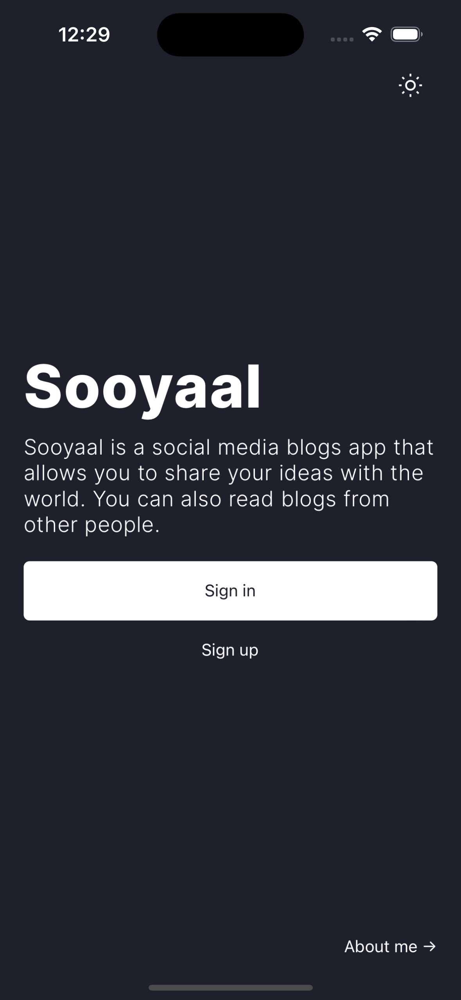
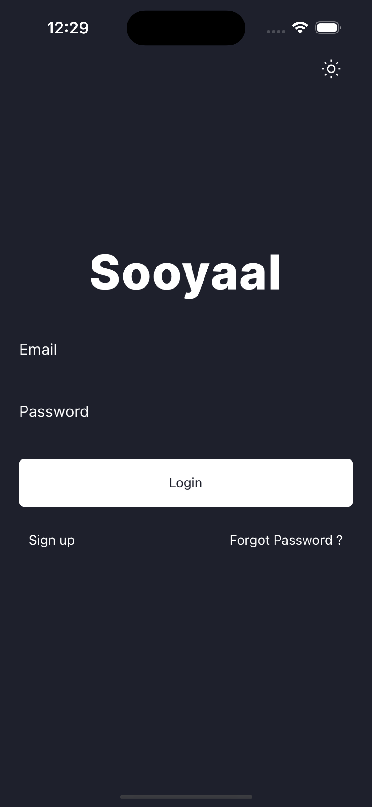
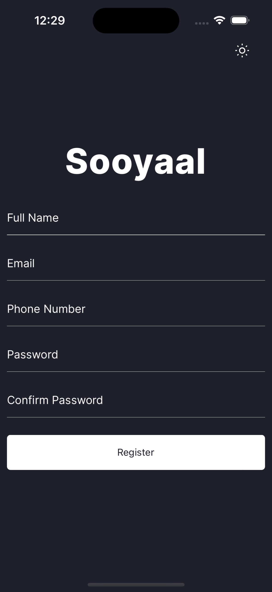
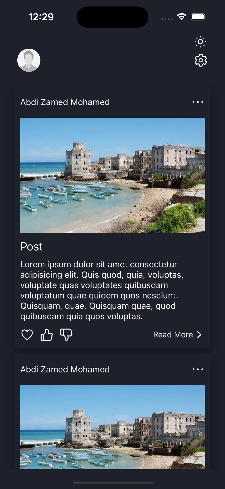

# Sooyaal Mobile App

Sooyaal is a social media blogging app that allows you to share your
ideas with the world. You can also read blogs from other people. you can like and dislike the blog posts of the people and you can add to your favourites basket.

## Features

- Light/dark mode toggle
- Login / Register screens
- Forgot password / Verify Code screen
- Cross platform
- Profile Page
- Reading all posts from the server
- and more features

## Screenshots

Here are some screenshots of the app

### 1 - Welcome Screen

### 2 - Login Screen

### 3 - Register Screen

### 4 - Welcome Screen

### 5 - Settings Screen

## Download

Download The App on
[Google Play]() or
[Apple Store]()

## Authors

- [@abdizamed](https://abdizamedmo.netlify.app/)

## Tech Stack

**Client:** React Native, Redux

**Server:** Node, Nestjs
